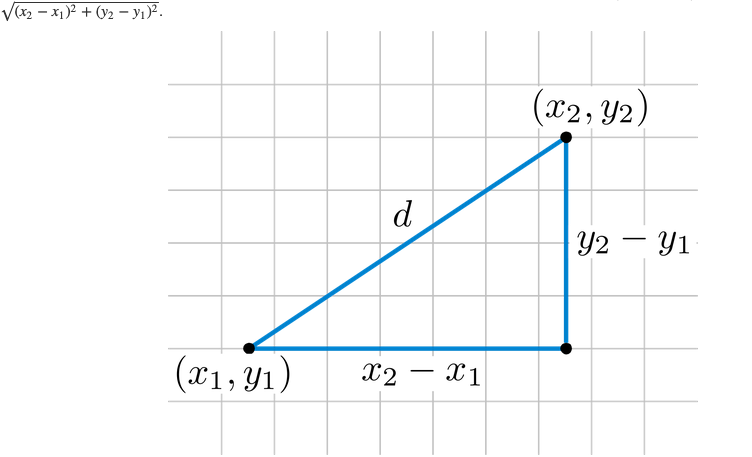
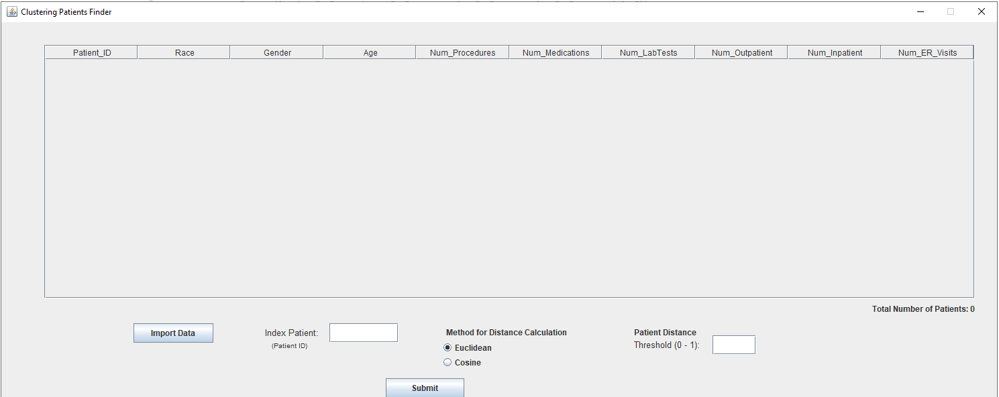
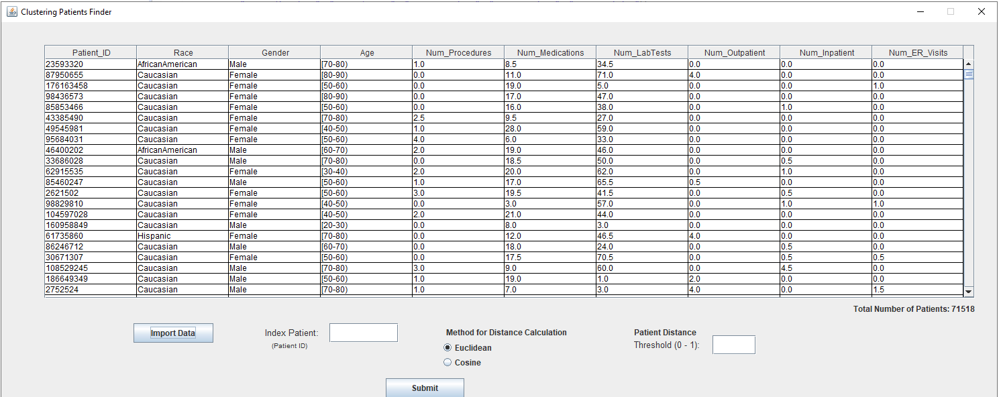
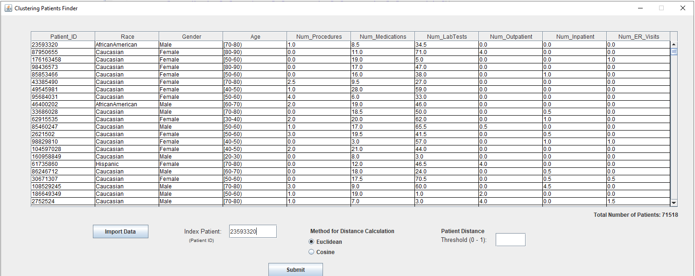
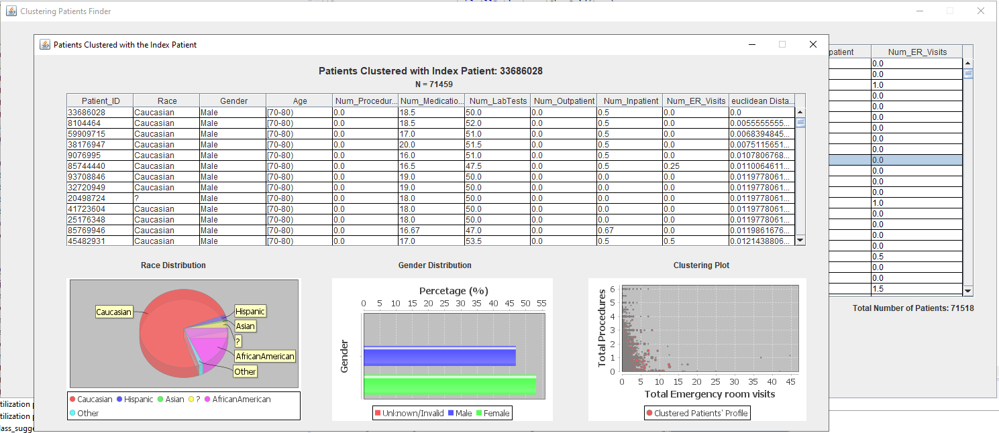

# MCIT 590 Final Project, TEAM 27

* SANTOSH NAZARE

* KEN HUANG

* NICK MORISI

## Summary

Our project finds clinically similar patients from a given set of patient population. It calculates the similarity between the *index* patient and all other `n` patients.  

The program reads in the data from a CSV file and creates a list of clinical encounters.  Using the list of clinical encounters, the software builds a clinical utilization for each patient profile (`HashMap`).  The unique patient identifier (`patient_number`) is the key and the patient's clincial profile is stored as value. The patient level clinical profile is created by averaging a patient's inpatient visits, outpatient visits, procedures, medications, lab procedures, and emergency visits.  These patient clinical utilization profiles are used to compute *similarity* between patients.  We used two methods to calculate the similiarity between patient's prfile, *Euclidean distance* and *Cosine distance*.  

The clinical profile is a vector of patient level measures. We compare the *index* patient’s clinical profile with all other patients’ clinical profiles to calculate similarity metric and return list of patient's which are within user provided threshold of similarity from *index* patient. The distance measure value ranges from 0 (*most similar*) to 1 (*least similar*)

## Distance measures

#### Euclidean distance

Euclidean distance is the distance between two points and is calculated using the Pythagorean Theorem 

(Rosalind 2020).  

For the `k`-dimensional data this formula is generalized to following form

Given, and  are utilization profiles for two patients, the *educlidean distance* between them is calcualted as

We used a scaled version of *euclidean distance* for our software, to force the range of values between 0 and 1 for easy interpretability. 

we calculated a maximum possible squared discrepancy for each variable. If `m` are the number of patients in the given sample, we caculated maximum squared discrepancy for variable $$i$$ is given by

then *scaled euclidean distance* is calculated as,

#### Cosine distance

The Cosine similarity is a measure of similarity is inner product space of two non-zero vectors, which measures cosine of angle between two vectors. 

Given,  and  are utilization profiles for two patients, the *cosine* similarity betweej them is calculated as,

 

and *cosine distance* is calculated as 

# Project Flow

The user runs the MainFrame.java file and the window below is displayed.

The "Import Data button" allows the user to select the "diabetic_data.csv" provided patient data.  The `MainFrame` then executes the `DataReader` class to read data into `ClinicalEncounters` class. Then methods in`PatientProcessor` class are executed to build `HashMap` of `Patient` class. Data from the `Patient` class is displayed in the window as below.

Once the data is imported the user can view and select an index patient for comparison against all other patients.

Once the user has selected the index patient, the user can either copy and paste or type in the patient ID into the Index Patient box. Additionally the user can choose Euclidean or Cosine distance calculations. Finally the user must enter a threshold value of 0 - 1 and then click submit. The MainFrame then executes PatientProcessor and Patient classes to develop profile HashMap. Finally the methods in `DataAnaylsis`, `ClusteringFrame`,` Plots`,` DataDisplay`,` mapValueCompatator` are called to calculate similarity values and display those values into three JCharts seen below.

The window then displays Race Distribution of patients, Gender distribution, and the Clustering plot.

# Project Setup and Component Installation:

# Step 1:

Follow video installing Window Builder SWING:

https://www.youtube.com/watch?v=K7R68JFd024

 Alternative:

(1)	Browse to: https://www.eclipse.org/windowbuilder/

(2)	Drag install icon in an open Eclipse window.

(3)	If installation does not start automatically the Eclipse Marketplace Window will open:

(4)	In search box type “Window Builder”

(5)	Follow instructions for installation:

# Step 2:

J Common and J Chart Installation

 (1)	Navigate to jfreechart-1.0.19-install.pdf

 (2)	Follow instructions on page 31, A3 for Eclipse installation.

(3)	Jcommon-1.0.23.zip and jfreechar-1.0.19.zip included for installation.

(4)	Once you add J Chart and J Common to your eclipse libraries, you may need to add the Library path into your project. See instructions below.

(1)	Right Click project, Select properties

(2)	Navigate to build path

(3)	Select Libraries

(4)	Add Library from Eclipse Libraries, this was competed during Jchart and JCommon installation.

References:

Hu, J., Wang, F., Sun, J., Sorrentino, R., & Ebadollahi, S. (2012). A healthcare utilization analysis framework for hot spotting and contextual anomaly detection. *AMIA ... Annual Symposium proceedings. AMIA Symposium*, *2012*, 360–369.

Rosalind 2020. http://rosalind.info/glossary/euclidean-distance/

Machine Learning Plus 2020. https://www.machinelearningplus.com/nlp/cosine-similarity/

Chris Emmery 2020. https://cmry.github.io/notes/euclidean-v-cosine

