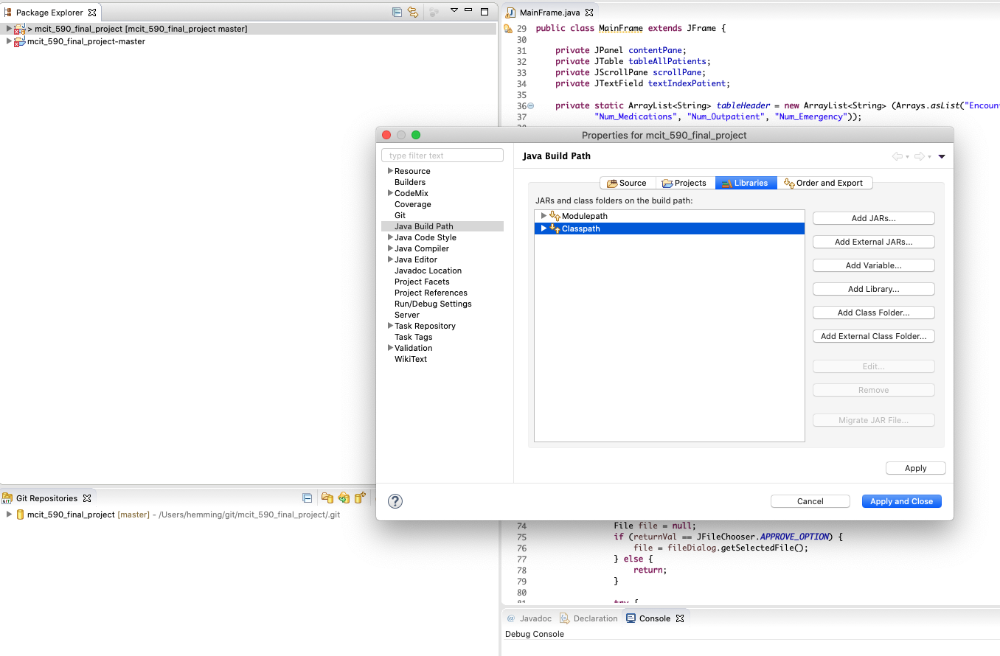

# MCIT 590 Final Project, TEAM 27

* SANTOSH NAZARE

* KEN HUANG

* NICK MORISI

# Summary:

Our project finds clinically similar patients from a patient population and calculates the similarity between the index patient and all other n patients.  The program reads in data from a CSV file and creates a list of clinical encounters.  Then from a list of clinical encounters the software creates a patient profile HashMap.  The patient NBR , patients unique identifier, is the key and value is the patient profile.  We built a patient level clinical profile by averaging a patient's inpatient visits, outpatient visits, procedures, medications, lab procedures, and emergency visits.  The patient profiles are used to calculate patient "similarity."  Our measures of similarity are Euclidean distance and Cosine similarity.  The clinical profile is a vector of patient level measures. We will compare the ‘index’ patient’s clinical profile with all other patients’ clinical profiles to calculate similarity metric with a user defined threshold of 0 to 1, a threshold closer to zero increases similarity.  The software then finds a cluster of patients within the threshold of similarity from the ‘index’ patient.

Euclidean distance is the distance between two points and is calculated using the Pythagorean Theorem 

                                   (Rosalind 2020).  

**SANTOSH or KEN expansion**

The Cosine similarity is a measure of similarity between entities regardless of distance or size (Machine Learning Plus 2020).  

**SANTOSH or Ken quick expansion**

# Project Flow:

The user runs the MainFrame.java file and the window below is displayed.

The "Import Data" button allows the user to select the "diabetic_data.csv" provided patient data.  The MainFrame then executes the DataReader class and the ClinicalEncounters class for data processing and importation.

Once the data is imported the user can view and select an index patient for comparison against all other patients.

Once the user has selected the index patient, the user can either copy and paste or type in the patient ID into the Index Patient box. Additionally the user can choose Euclidean or Cosine distance calculations. Finally the user must enter a threshold value of 0 - 1 and then click submit. The MainFrame then executes PatientProcessor and Patient classes to develop profile HashMap. Finally the DataAnaylsis, ClusteringFrame, Plots, DataDisplay, mapValueCompatator, and Plots are called to calculate similarity values and display those values into three JCharts seen below.

The window then displays Race Distribution of patients, Gender distribution, and the Clustering plot.

# Project Setup and Component Installation:

# Step 1:

Follow video installing Window Builder SWING:

https://www.youtube.com/watch?v=K7R68JFd024

 Alternative:

(1)	Browse to: https://www.eclipse.org/windowbuilder/

(2)	Drag install icon in an open Eclipse window.

(3)	If installation does not start automatically the Eclipse Marketplace Window will open:

(4)	In search box type “Window Builder”

(5)	Follow instructions for installation:

# Step 2:

J Common and J Chart Installation

 (1)	Navigate to jfreechart-1.0.19-install.pdf

 (2)	Follow instructions on page 31, A3 for Eclipse installation.

(3)	Jcommon-1.0.23.zip and jfreechar-1.0.19.zip included for installation.

(4)	Once you add J Chart and J Common to your eclipse libraries, you may need to add the Library path into your project. See instructions below.

(1)	Right Click project, Select properties

(2)	Navigate to build path

(3)	Select Libraries

(4)	Add Library from Eclipse Libraries, this was completed during Jchart and JCommon installation.

References:

Hu, J., Wang, F., Sun, J., Sorrentino, R., & Ebadollahi, S. (2012). A healthcare utilization analysis framework for hot spotting and contextual anomaly detection. *AMIA ... Annual Symposium proceedings. AMIA Symposium*, *2012*, 360–369.

Rosalind 2020. http://rosalind.info/glossary/euclidean-distance/

Machine Learning Plus 2020. https://www.machinelearningplus.com/nlp/cosine-similarity/

Chris Emmery 2020. https://cmry.github.io/notes/euclidean-v-cosine

